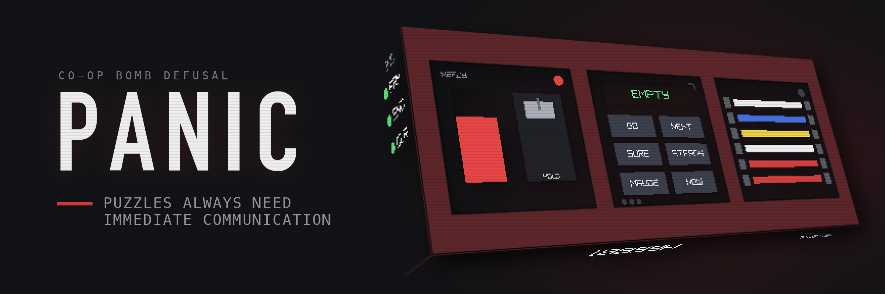

# PANIC - Puzzles Always Need Immediate Communication



PANIC is a small 3D bomb-defusal game inspired by *Keep Talking and Nobody Explodes*. One player
(the **Defuser**) sees the bomb but has no instructions; their teammate (the
**Expert**) has access to the [manual](https://chiaxr.github.io/PANIC/manual.html) but cannot see the bomb. They have to communicate with each other to disarm the bomb before the timer runs out.

[Try it here now!](https://chiaxr.github.io/PANIC/)

## Gameplay

The title screen carries the run's seed: a **bomb serial number** and a **difficulty slider**.
Together they seed everything about the bomb — its attributes, which modules spawn, where they sit,
and each module's own variables — so noting the pair down replays exactly the same bomb. The box
starts with a randomly generated serial; click it to edit. Difficulty sets how many of the six bays
are filled, from 1 to 6.

Rotate the bomb to inspect its faces and read the widgets aloud to your Expert. Each **module**
must be disarmed before the countdown reaches zero. Three **strikes** and the bomb detonates.

Modules may depend on bomb-wide facts printed on the casing, so the Expert always needs information
only the Defuser can see:

| Widget | What to read out |
| --- | --- |
| Serial # | The six-character code (its last digit's parity is the most-used fact) |
| Batteries | How many cells sit in the battery tray on the top edge |
| Indicators | Which labelled lights (`CAR`, `FRK`, …) are lit vs unlit |

A bomb fills as many bays as the difficulty asks for, drawn at random without repeats:

| Module | What the Defuser does |
| --- | --- |
| Wires | Cuts exactly one of 3-6 coloured wires |
| The Button | Taps or holds a coloured button, releasing on the right countdown digit |
| Keypads | Presses four symbols in the order one manual column lists them |
| Passwords | Cycles five letter wheels to the only spellable word, then submits |
| Memory | Presses one of four numbered buttons across five stages, referring back to earlier ones |
| Simon Says | Repeats a flashing colour sequence, remapped by serial vowel and strike count |
| Who's on First | Reads one button's label, then presses the first label on that label's priority list |
| Morse Code | Decodes a blinking word and transmits its frequency |
| Complicated Wires | Cuts each wire or not, from its colours, star and LED |
| Wire Sequences | Cuts wires across four panels, counting each colour as it goes |
| Mazes | Steers a marker to the goal through walls only the Expert can see |
| Fold-Out | Folds a flat cube net in their head and presses the opposite face |
| Tape Reader | Executes a printed program by hand and types the result |
| Pipeworks | Rotates pipe tiles to route flow to an outlet only the Expert knows |
| Star Chart | Identifies a rotated constellation and presses the star it names |
| Colour Match | Finds a colour the Expert can only describe, on an Oklab colour wheel |

At difficulty 3 and above, up to one bay holds a **needy** module instead. Needy modules are never disarmed and are not
counted in the module total — they wake up periodically for the whole round and demand attention:

| Needy module | What the Defuser does |
| --- | --- |
| Venting Gas | Answers Y or N before the countdown runs out |
| Capacitor Discharge | Holds a lever to drain a capacitor before it overloads |
| Knobs | Turns a knob to the position the twelve lights call for |

The Expert looks the rules up in the manual and talks the Defuser through them. A wrong move earns
a strike.

PANIC follows the same module *mechanics* as *Keep Talking and Nobody Explodes*, but every lookup
table — keypad symbol columns, Who's on First words and priority lists, Simon's colour mappings,
Morse frequencies — is PANIC's own, generated and checked for solvability. Use this repository's
manual, not any other.

## Controls

| Input | Action |
| --- | --- |
| Arrow keys | Move the title-screen / end-screen selection |
| Enter / Space / Mouse click / Tap | Activate the selected button |
| Left / Right arrows | Move the difficulty slider (it can also be dragged) |
| Backspace | Leave Instructions; step back out of a focused module |
| Drag (mouse / one finger) | Rotate the bomb (free look only) |
| Mouse wheel / two-finger pinch | Zoom the view in and out (free look only) |
| Mouse click / Tap on a module | Zoom in on it |
| Mouse click / Tap on a focused module | Interact with it (e.g. cut a wire) |
| Right-click / Tap away from the module | Step back out to free look |
| R | Roll a new serial and start a fresh bomb (on the win/loss screen); roll a new seed (in debug mode) |
| M | Back to the module list (in debug mode) |
| Esc / window close | Quit the native desktop build |

The web version is landscape-only. In portrait orientation the game pauses and a rotate prompt
is shown until the viewport returns to landscape.

## Debug mode

The small **DEBUG** button in the title screen's bottom-right corner plays a single module on an
otherwise empty bomb, for checking that a module behaves as its manual section says.

Pick the module from the list and the serial it is built from — the serial alone decides the
module's variables here, so the same serial always reproduces the same puzzle, and `RANDOM` (or
`R` while playing) rolls another one. Needy modules are marked as such in the list.

A debug round has no time limit: the countdown still runs, because the modules that read it (The
Button's release digit, the needy wake-up timers) have to behave as they do in a real round, but
it wraps back to full instead of running out. Strikes are counted and shown, but never detonate,
and solving the module leaves the round running so it can be poked further.

## Adding Your Own Module

A module is a `Puzzle` subclass plus a manual section. Nothing else on the bomb needs to know it
exists: the bomb hands it the bomb-wide attributes, gives it a square canvas to draw into, and
feeds it taps already converted into that canvas's pixels, so a module never deals with 3D.

### 1. Write the puzzle

Modules live in `include/puzzles/` and `src/puzzles/`, one `snake_case` pair per module. Say the
module is called *Toggles*:

```cpp
// include/puzzles/toggles_puzzle.h
#pragma once

#include "puzzle.h"

class TogglesPuzzle : public Puzzle {
public:
    const char* name() const override { return "Toggles"; }
    void init(const BombAttributes& attrs, std::mt19937& rng) override;
    void update(const ModuleInput& in, const BombContext& ctx,
                float dt) override;
    void draw() override;

    // What the face is made of, which is how the renderer lights it. Pick the
    // entry from `materials` (include/shading.h) that matches the components
    // you draw; leaving it out gives the moulded plastic of a bare panel.
    SurfaceMaterial material() const override {
        return materials::glossy_plastic;
    }

private:
    bool on_[4] = {false, false, false, false};
    int correct_index_ = 0;
};
```

```cpp
// src/puzzles/toggles_puzzle.cpp
#include "puzzles/toggles_puzzle.h"

#include "raylib.h"

namespace {
constexpr float cell = module_tex_size / 4.0f;
}  // namespace

void TogglesPuzzle::init(const BombAttributes& attrs, std::mt19937& rng) {
    // Derive the answer from what the Defuser can read out to the Expert...
    correct_index_ = attrs.serial_last_digit_odd() ? 0 : 3;
    // ...and take any randomness from the bomb's seeded generator, never from
    // std::random_device.
    if (attrs.battery_count > 2) {
        correct_index_ = std::uniform_int_distribution<int>(0, 3)(rng);
    }
}

void TogglesPuzzle::update(const ModuleInput& in, const BombContext& ctx,
                           float dt) {
    (void)ctx;   // live strikes / time left, if the module needs them
    (void)dt;
    if (is_solved() || !in.tapped) return;

    const int idx = static_cast<int>(in.tap_pos.x / cell);
    if (idx < 0 || idx > 3) return;

    on_[idx] = !on_[idx];
    if (idx == correct_index_) {
        mark_solved();
    } else {
        raise_strike();
    }
}

void TogglesPuzzle::draw() {
    for (int i = 0; i < 4; ++i) {
        DrawRectangle(static_cast<int>(i * cell), 180,
                      static_cast<int>(cell) - 8, 150,
                      on_[i] ? Color{220, 190, 60, 255} : Color{60, 62, 70, 255});
    }
}
```

The three overrides:

| Override | Contract |
| --- | --- |
| `init(attrs, rng)` | Pick the module's variables once, when the bomb is built. `attrs` is the serial, battery count, and indicators (see `include/bomb_attributes.h`, which also has the derived queries the modules lean on, such as `serial_last_digit_odd()` and `has_lit_indicator("FRK")`). |
| `update(in, ctx, dt)` | Runs every frame, even when the module is not focused. `in` only carries pointer events while it *is* focused: `tapped`/`tap_pos` for a click on the spot, and `pressed`/`held`/`released` for press-and-hold interactions. `ctx` carries the live strike count and time left. Call `mark_solved()` on success and `raise_strike()` on a mistake. |
| `draw()` | 2D raylib calls into a `module_tex_size` (512px) square, origin top-left, y down. The bomb renders this into the module's own texture and maps it onto the bay; taps arrive in the same pixel space, so drawing and hit-testing use identical coordinates. |

### 2. Register it in three places

```cpp
// src/bomb.cpp -- include the header, then in register_builtin_puzzles():
reg.add("Toggles", [] { return std::unique_ptr<Puzzle>(new TogglesPuzzle()); });

// src/bomb.cpp -- and add the same name to the module_templates list, which is
// the pool bombs are drawn from (and the debug picker's menu). Remember to bump
// the std::array size.
constexpr std::array<const char*, 19> module_templates = { ..., "Toggles" };
```

```cmake
# CMakeLists.txt -- add the source to the panic_game target
src/puzzles/toggles_puzzle.cpp
```

The registry is filled explicitly rather than by static initializers, so that the static library
never drops a puzzle translation unit; a module that is registered but missing from
`module_templates` will never appear on a bomb.

### 3. Write the manual section

Add a `<section>` to `manual/index.html` and a matching entry to its table of contents. **The
in-game logic and the manual must agree** — the manual is the only thing the Expert has, and a
rule that does not match the code is an unsolvable module. Keep the rules decidable from what the
Defuser can actually see and read aloud.

### 4. Keep it deterministic

A serial number and difficulty must always rebuild exactly the same bomb, so:

- Take all randomness from the `rng` handed to `init()`. Never use `std::random_device`, and never
  use an unseeded engine.
- If the module needs randomness *during play* (dealing a later stage, picking a wake-up time),
  keep a `std::mt19937` member seeded from that `rng` in `init()` — not a function-local `static`.
- Read the clock and strike count from the `BombContext` passed to `update()`, not from globals.

### 5. Needy modules (optional)

A needy module is never disarmed; it wakes up periodically and demands attention for the whole
round. Subclass `NeedyPuzzle` instead of `Puzzle`, call `reset_needy(rng)` from `init()` and
`tick_needy(dt)` from `update()`, override `on_activate()` to deal a fresh demand, and call
`satisfy()` once it has been met. `on_expire()` defaults to a strike. Bombs cap needy modules at
one and place none below difficulty 3, so at least five bays stay solvable.

### 6. Try it

Build, then use the **DEBUG** button on the title screen to play the new module alone on an
otherwise empty bomb, checking a few serials against what the manual says the Expert should be
telling the Defuser to do.

### 7. Check it

```sh
python3 scripts/verify_manual.py     # the manual and the C++ hold the same tables
python3 scripts/verify_puzzles.py    # the tables can always be resolved to one answer
```

Both take module names to run a single check. If the new module prints a table in the manual, add
a case to `panic_parse.py` and `verify_manual.py` so the two copies stay tied together;
`scripts/expert_solver.py` is the Expert's side of the manual on the command line and is worth
extending too, since it makes play-testing a module a one-liner. `star_chart_catalogue.py` is the
same idea for Star Chart's constellation geometry, and `color_palette.py` for Colour Match's
colour wheel -- it builds the wheel from the sRGB gamut cusp in Oklab, searches for a palette
that stays apart both in colour and in aiming distance on the wheel, and reports how much of
that separation survives colour blindness.


## Native Build

Requirements: CMake 3.16+, a C++17 compiler, and Git. raylib 6.0 is fetched automatically by
CMake.

```bash
cmake -S . -B build -DPANIC_BUILD_NATIVE=ON -DCMAKE_BUILD_TYPE=Release
cmake --build build
```

Run the native executable:

```bash
./build/PANIC
```

Platform notes:

- macOS native builds link the Cocoa, IOKit, and OpenGL frameworks.
- Linux native builds use the normal raylib desktop dependencies such as OpenGL and
  X11/Wayland development packages.
- The desktop build does not depend on Emscripten, JavaScript, or web files.

## Local Emscripten Build

Install and activate Emscripten first, then configure with `emcmake`. `PANIC_BUILD_NATIVE` and
`PANIC_BUILD_WEB` are mutually exclusive.

```bash
emcmake cmake -S . -B build-web \
  -DCMAKE_BUILD_TYPE=Release \
  -DPANIC_BUILD_NATIVE=OFF \
  -DPANIC_BUILD_WEB=ON

cmake --build build-web --target panic_web
```

Expected outputs:

```text
build-web/dist/index.html
build-web/dist/index.js
build-web/dist/index.wasm
build-web/dist/manual.html
```

Serve locally with:

```bash
emrun build-web/dist/index.html
```

You can also serve `build-web/dist` with any static file server. The Defuser's manual is bundled
alongside the game as `manual.html`.

## Project Structure

```text
PANIC/
|-- CMakeLists.txt
|-- .github/workflows/pages.yml
|-- include/
|   |-- app.h
|   |-- bomb.h
|   |-- bomb_attributes.h
|   |-- game.h
|   |-- puzzle.h
|   `-- puzzles/
|       `-- wires_puzzle.h
|-- src/
|   |-- app.cpp
|   |-- bomb.cpp
|   |-- game.cpp
|   |-- main.cpp
|   |-- puzzles/
|   |   `-- wires_puzzle.cpp
|   `-- web/
|       `-- web_main.cpp
|-- web/
|   `-- emscripten_shell.html
|-- manual/
|   `-- index.html
|-- scripts/
|   |-- panic_parse.py            # reads the tables out of the manual and the C++
|   |-- verify_manual.py          # diffs the two copies of every printed table
|   |-- verify_puzzles.py         # feasibility: one answer, always reachable
|   |-- expert_solver.py          # the manual's rules on the command line
|   |-- star_chart_catalogue.py   # search and check Star Chart's constellations
|   `-- color_palette.py          # search and check Colour Match's Oklab wheel
`-- doc/
    `-- panic.png
```

`panic_game` contains the shared application, game, bomb, and puzzle code. `PANIC` is the native
launcher. `panic_web` is the Emscripten launcher and uses `emscripten_set_main_loop()`. Puzzle
modules implement the `Puzzle` interface (see `puzzles/wires_puzzle.*`) and read the bomb's
attributes to pick their variables; the in-game logic and `manual/index.html` are kept in sync.
